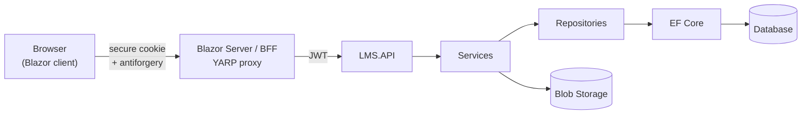
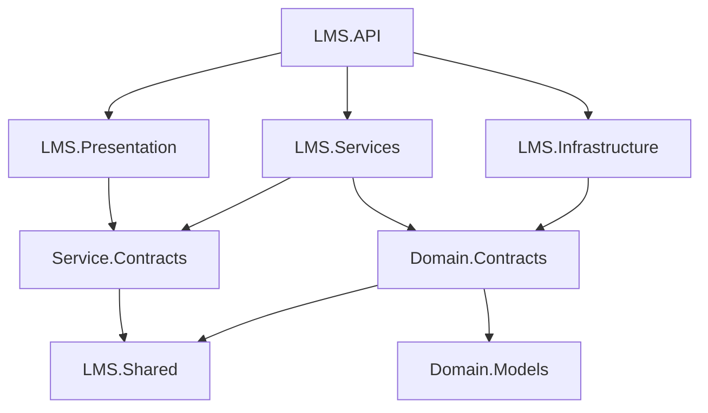

# Architecture

## Request flow

The client never calls the API directly. All requests go through the Blazor server, which acts as a Backend for Frontend (BFF) and forwards calls to the API with YARP.

- The browser authenticates against the BFF with a secure cookie.
- The BFF forwards requests to the API with a JWT issued by the API.
- Write requests (POST, PUT, PATCH, DELETE) are protected against CSRF with antiforgery tokens.

## API projects

| Project | Responsibility |
|---|---|
| **LMS.API** | Application startup: dependency injection, middleware, authentication and authorization, Swagger, request pipeline |
| **LMS.Presentation** | Controllers. Receive requests, return responses and call the service layer through `IServiceManager` |
| **Service.Contracts** | Service interfaces and `IServiceManager` |
| **LMS.Services** | Business logic, use cases, validation and `ServiceManager`. Works with data through `IUnitOfWork` |
| **Domain.Models** | Entities, including `ApplicationUser` |
| **Domain.Contracts** | Repository interfaces and `IUnitOfWork` |
| **LMS.Infrastructure** | EF Core, `DbContext`, repositories, `UnitOfWork`, entity configurations and migrations |
| **LMS.Shared** | DTOs, enums, response models and other shared types |

## Project dependencies

An arrow means *"has a project reference to"*.

| Project | References directly | Gets transitively |
|---|---|---|
| **LMS.API** | LMS.Presentation, LMS.Services, LMS.Infrastructure | All projects |
| **LMS.Presentation** | Service.Contracts | LMS.Shared |
| **LMS.Services** | Service.Contracts, Domain.Contracts | Domain.Models, LMS.Shared |
| **Service.Contracts** | LMS.Shared | – |
| **LMS.Infrastructure** | Domain.Contracts | Domain.Models, LMS.Shared |
| **Domain.Contracts** | Domain.Models, LMS.Shared | – |
| **Domain.Models** | – | – |
| **LMS.Shared** | – | – |

### Rules

- Controllers only know about `IServiceManager` and DTOs. Presentation never references Infrastructure or the entities.
- Services access data only through `IUnitOfWork` and repository interfaces, never through `DbContext` directly.
- Repositories return entities, not DTOs. Mapping to DTOs happens in the service layer.
- LMS.API is the only place where all layers are wired together.
- Repositories are entity-based. Use cases that combine data, such as dashboards, belong in a service (e.g. `DashboardService`) and do not get their own repository or table.

## Validation and error handling

**Field validation** (required fields, formats, max length) uses DataAnnotations on the DTOs in `LMS.Shared`. Because the DTOs are shared, the same rules apply in Blazor forms and in the API.

**Business rules** that need data from the database (date ranges, overlaps, access to a course) are checked in the service layer. Services throw custom exceptions:

| Exception | HTTP status |
|---|---|
| `NotFoundException` | 404 Not Found |
| `BusinessRuleException` | 400 Bad Request / 409 Conflict |

A global exception handler in `LMS.API` translates these exceptions into `ProblemDetails` responses. Controllers contain no try/catch, and Blazor displays errors the same way across the application.
