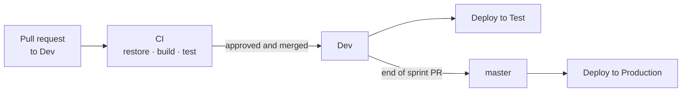

# Deployment

## Environments

| Environment | Deployed from | Purpose |
|---|---|---|
| Local | – | Development on each team member's machine |
| Test | `Dev` | Verifying merged features in Azure before release |
| Production | `master` | Sprint demos and final delivery |

Test and production each have their own database and their own blob container. Nobody tests against the production database.

## Azure resources

| Resource | Service |
|---|---|
| Blazor / BFF | Azure Container Apps |
| API | Azure Container Apps |
| Database | Azure SQL Database (lowest fixed-cost tier) |
| File storage | Azure Blob Storage (Standard, LRS, Hot) |

A budget alert in Azure Cost Management keeps track of the shared credit.

## Pipeline

### Continuous integration

CI restores, builds and tests the solution on every pull request. A failed build or test is shown in the pull request and blocks the merge.

### Continuous deployment

- A merge into `Dev` deploys to the test environment.
- At the end of each sprint, `Dev` is merged into `master` through a pull request, which deploys to production.
