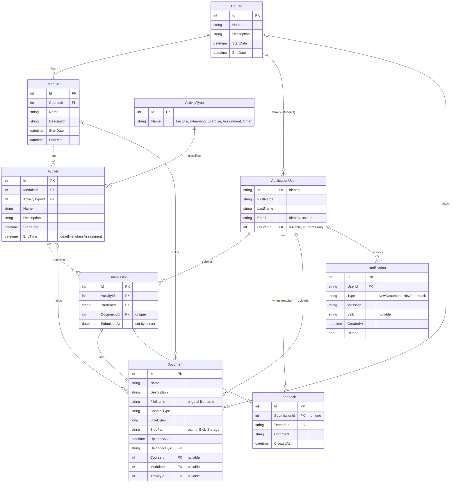

# ER diagram

> **Status:** Draft – pending team review and approval.
> Source file: [`er-diagram.mmd`](er-diagram.mmd)

**Notation:** `||` exactly one · `|o` zero or one · `o{` zero or more · `PK` primary key · `FK` foreign key

## Business rules

| Rule | Enforced in |
|---|---|
| Start date is before end date (course, module, activity) | DTO + service |
| A module is within the course period and does not overlap other modules in the course | `ModuleService` |
| An activity is within the module period and does not overlap other activities in the module | `ActivityService` |
| A student belongs to exactly one course | `UserService` |
| Access to course, document and submission data depends on role and course membership, even if an id or URL is manipulated | Services |
| File uploads validate file type and file size | `DocumentService` |

Invalid dates and overlaps are always rejected server-side, not only in the Blazor UI.
